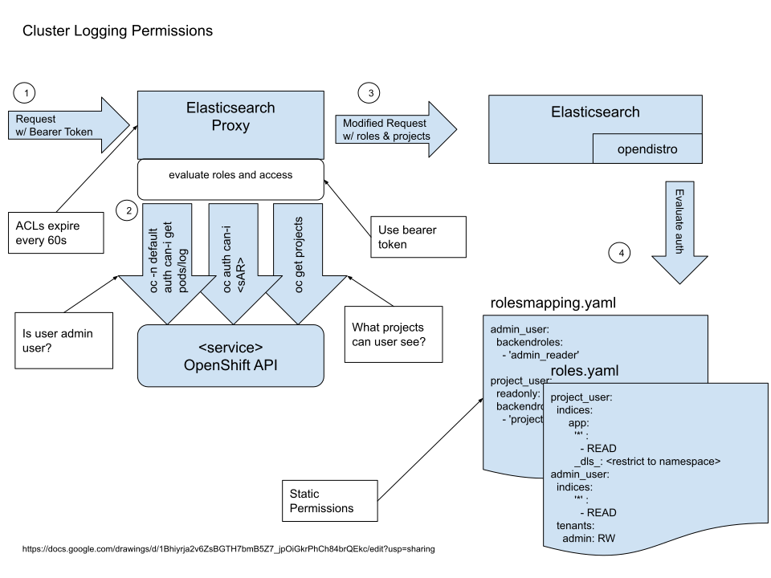

# Access Control
Authentication and authorization is provided by using a combination of the [Open Distro for Elasticsearch](https://opendistro.github.io/for-elasticsearch/) plugin and the [elasticsearch-proxy](https://github.com/openshift/elasticsearch-proxy).  The plugin relies upon [statically defined OpenDistro roles](https://github.com/openshift/origin-aggregated-logging/tree/master/elasticsearch/sgconfig) and a user's OpenShift Roles and projects to determine access to logs.  Following is a brief explanation how roles and role mappings are evaluated in an ElasticSearch deployment for OpenShift logging to control access to log records.  Please see the official [Open Distro security documentation](https://opendistro.github.io/for-elasticsearch-docs/docs/security/) for additional information.

## Role Definitions and Permissions
Permissions are statically defined and seeded when the Elasticsearch cluster starts.  They are grouped into two distinct roles: project user, administrator. Figure 1 diagrams the workflow to evaluate a user's access.  The calls to the OpenShfit API server are cached by the elasticsearch-proxy and periodically expire so they stay in sync with OpenShift permissions.

**Figure 1**



### Project user
Project users are able to access logs from any namespace to which they have access as determined by the equivalent call:
```
oc get projects --token $USERTOKEN
```

### Admin user
An admin user is able to access all collected logs(i.e. app, infra, audit) if they have an admin role as determined by:
```
oc  -n default auth policy can-i get pods/logs
```
