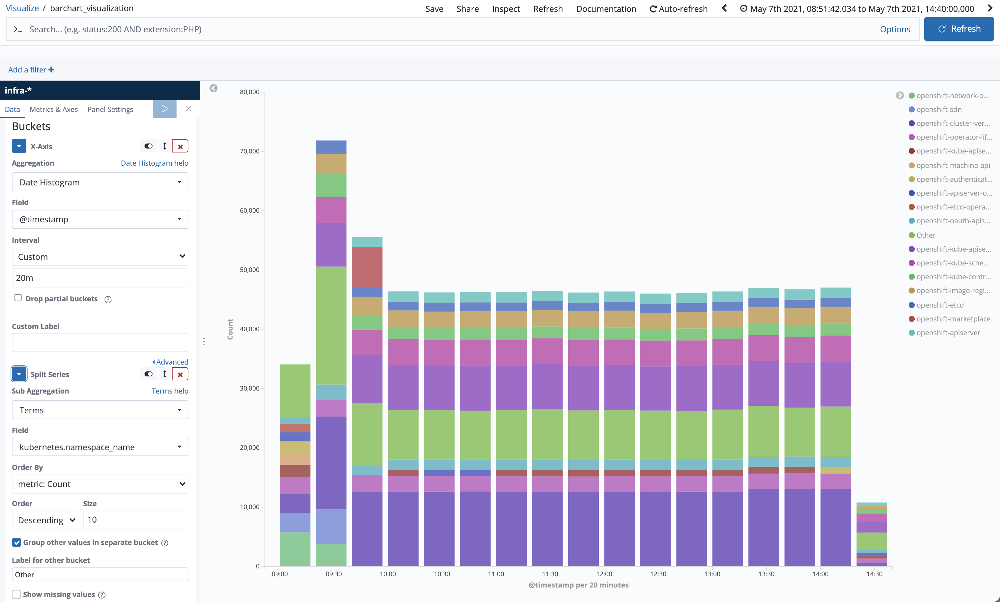
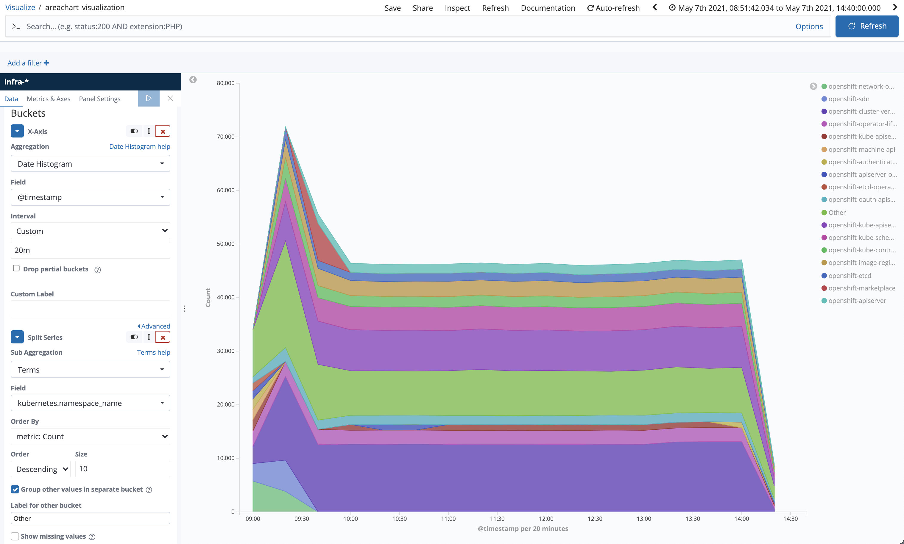
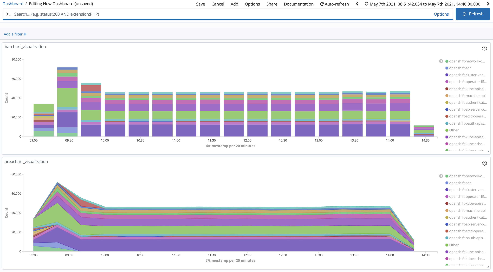
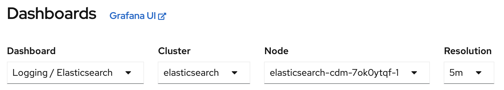
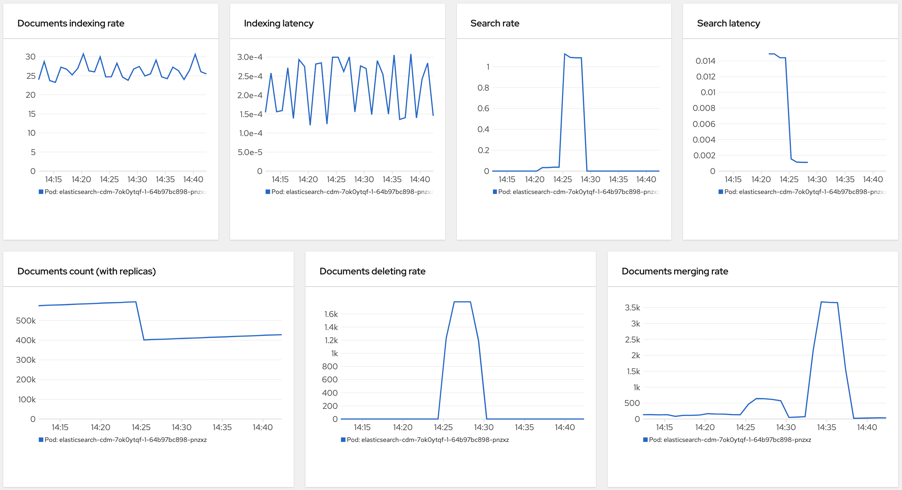

# Troubleshooting

## Kibana

### Why am I unable to see infrastructure logs
Infrastructure logs are visible from the `Global` tenant and require `administrator` permissions. See the [access control](access-control.md) documentation for additional information about how a user is determined to have the `administrator` role.
### kube:admin is unable to see infrastructure logs
`kube:admin` by default does not have the correct permissions to be given the admin role.   See the [access control](access-control.md) documentation for additional information.  You may grant the permissions by:
```
oc adm policy add-cluster-role-to-user cluster-admin kube:admin
```
## Elasticsearch Indices

### Why are elasticsearch indices marked as read-only-allow-delete
If an elasticsearch node exceeds its [flood watermark threshold](https://www.elastic.co/guide/en/elasticsearch/reference/6.8/disk-allocator.html#disk-allocator), Elasticsearch enforces a read-only index block on every index that has one or more shards allocated on the node.

### How can I unblock the indices
Check out this [documentation](https://github.com/openshift/elasticsearch-operator/blob/master/docs/alerts.md#elasticsearch-node-disk-flood-watermark-reached) on what steps to take when flood watermark threshold has been reached.

Once the disk utilization of that particular node drops below flood watermark threshold, Elasticsearch Operator will automatically unblock all the indices except the `.security` index since elasticsearch-operator cannot modify the `.security` index. Use below command to unblock the `.security` index:
```
oc exec -n openshift-logging -c elasticsearch <elasticsearch_pod_name> -- es_util --query=.security/_settings?pretty -X PUT -d '{"index.blocks.read_only_allow_delete": null}'
```

You can also manually unblock all indices by using this command:
```
oc exec -n openshift-logging -c elasticsearch <elasticsearch_pod_name> -- es_util --query=_all/_settings?pretty -X PUT -d '{"index.blocks.read_only_allow_delete": null}'
```

## Amount of logs per project

The new [data model](https://github.com/openshift/enhancements/blob/master/enhancements/cluster-logging/cluster-logging-es-rollover-data-design.md#data-model) was introduced in OCP 4.5.
Since then, the logs from individual namespaces no longer end up in dedicated indices by default, but they share a common index.

To learn which projects are generating most of the logs you can use Elasticsearch query language to calculate
aggregated statistics.

The following is an example of hourly date histogram aggregation (for last three hours) with nested number of logs grouped by top namespaces:


```json
GET /app,infra,audit/_search
{
  "size": 0,
  "query": {
    "range": {
      "@timestamp": {
        "gte": "now-3h",
        "lt": "now"
      }
    }
  },
  "aggs": {
    "Histogram": {
      "date_histogram": {
        "field": "@timestamp",
        "interval": "hour"
      },
      "aggs": {
        "top_namespaces": {
          "terms": {
            "size": 10,
            "order" : { "_count" : "desc"},
            "field": "kubernetes.namespace_name"
          }
        }
      }
    }
  }
}
```
You can leave out any members from `[app,infra,audit]` list in the beginning to make the query more focused.

The query is in the format that can be directly used in Kibana [Dev Tools Console](https://www.elastic.co/guide/en/kibana/6.8/console-kibana.html) window. To use this query in CLI save it into a file called `query_1.json` (see example [query_1.json](./troubleshooting_resources/query_1.json) file) and execute:

```shell
QUERY=`cat query_1.json`; \
oc exec <es_pod> -c elasticsearch -- \
  es_util --query="app,infra,audit/_search?pretty" \
  -d "$QUERY"
```

It is also possible to create Kibana Visualizations:

<table>
<tr>
<td>
Vertical Bar-chart

[](./images/troubleshooting/barchart_visualization.png)
</td>
<td>
Area-chart

[](./images/troubleshooting/areachart_visualization.png)
</td>
</tr>
<tr>
<td colspan="2">
And finally, simple Dashboard (with both the above charts)

[](./images/troubleshooting/dashboard_logs_by_namespace.png)
</td>
</tr>
</table>

## Delete logs for specific namespace

Data curation in Elasticsearch is best done by [deleting indices](https://www.elastic.co/guide/en/elasticsearch/reference/6.8/indices-delete-index.html) (for example deleting old daily indices). Unfortunately, when logs are stored in common index and logs for specific namespace need to be deleted then dropping whole index is not an option. Fortunately, Elasticsearch provides dedicated [Delete By Query](https://www.elastic.co/guide/en/elasticsearch/reference/6.8/docs-delete-by-query.html) API for this purpose. This chapter will discuss how this API can be used.

It should be highlighted that use of this API to delete selected documents from index is often associated with high system resource consumption:
- First – when the query is running to find and flag all matching documents as deleted
- Second – when deleted documents are purged from the disk when Lucene index segments are merged
  
Both these aspects will be illustrated and relevant metrics will be explained.

Especially the second phase will consume [some CPU threads](https://www.elastic.co/guide/en/elasticsearch/reference/6.8/index-modules-merge.html#merge-scheduling). Once threads are assigned to segments merge they can not be used by other intensive operations, like indexing, until the merge is finished. ES will make sure that not all threads are used by merging process (via merging throttling) but still it can have impact on ES cluster performance. The merge will also consume additional storage capacity for temporary copy of merged segments. 

In short, deleting individual documents from index can be expensive operation and should be used carefully. It is not recommended calling this operation from cron on regular basis if there is a risk that associated cost will impact ES cluster performance significantly (for example it can cause indexing requests to be rejected or storage to run out of capacity), though it can make sense in emergency situations. In any case Elasticsearch metrics should be inspected (also notice that Delete By Query API has many tuning options, and it is also possible to terminate running operation if there is a need).   

The key in deleting documents from an index is in constructing appropriate ES query that matches all required documents. To learn how to write specific queries consult [ES Query DSL](https://www.elastic.co/guide/en/elasticsearch/reference/6.8/query-dsl.html) documentation specifically the part about [query filter context](https://www.elastic.co/guide/en/elasticsearch/reference/6.8/query-filter-context.html).

We recommend testing the query first (Kibana [Dev Tools Console](https://www.elastic.co/guide/en/kibana/6.8/console-kibana.html) is a handy tool) before it is used in the `_delete_by_query` API context. 

For example to match all **infra** logs from both the "**openshift-cluster-version**" and "**openshift-kube-apiserver**" namespaces you can use the following query:
```json
GET /infra/_search
{
  "query" : {
    "terms": {
      "kubernetes.namespace_name": [
        "openshift-cluster-version",
        "openshift-kube-apiserver"
      ]
    }
  }
}
```

To match only those logs that are **older than 24 rhs** you need to add additional [range filter](https://www.elastic.co/guide/en/elasticsearch/reference/6.8/query-dsl-range-query.html) into this query:
```json
GET /infra/_search
{
  "query": {
    "bool": {
      "must": [
        {
          "terms": {
            "kubernetes.namespace_name": [
              "openshift-cluster-version",
              "openshift-kube-apiserver"
            ]
          }
        }
      ],
      "filter": [
        {
          "range": {
            "@timestamp": { "lt": "now-24h" }    // <- older than 24 hrs, lt = less-than
          }
        }
      ]
    }
  }
}
```
Once the query is prepared, it is used to delete the documents. All it takes it just changing the very first line of the snippet from `GET <...>/_search` to `POST <...>/_delete_by_query`:

```json
POST /infra/_delete_by_query
{
  "query": {    // <- this is the same query
    ... 
  }
}

# If you face this error in Kibana UI then you shall execute the query from CLI
{
  "type": "security_exception",
  "reason": "no permissions for [indices:data/write/delete/byquery] and User [name=kube:admin, roles=[admin_reader], requestedTenant=__user__]"
}
```

CLI approach would be similar (see [query_2.json](./troubleshooting_resources/query_2.json) file example):
```shell
QUERY=`cat query_2.json`; \
oc exec <es_pod> -c elasticsearch -- es_util --query=infra/_delete_by_query?pretty \
  -X POST -d "$QUERY"

# Example Elasticsearch response  
{
  "took" : 16308,
  "timed_out" : false,
  "total" : 291607,
  "deleted" : 291607,
  "batches" : 292,
  "version_conflicts" : 0,
  "noops" : 0,
  "retries" : {
    "bulk" : 0,
    "search" : 0
  },
  "throttled_millis" : 0,
  "requests_per_second" : -1.0,
  "throttled_until_millis" : 0,
  "failures" : [ ]
}
```

After this operation finishes all query matching documents are no longer available in Elasticsearch (the data can not be pulled via `_search` or `_get` API endpoints or by any other means). However, this does not have to mean that the physical data has been purged from the storage yet.

Deleted documents are purged only during Lucene index [segments merge](https://www.elastic.co/guide/en/elasticsearch/reference/6.8/index-modules-merge.html). Elasticsearch uses internal heuristics to run merge operations in the background, but it also provides [Force Merge API](https://www.elastic.co/guide/en/elasticsearch/reference/6.8/indices-forcemerge.html) to enable ad-hoc execution of segments merge.

First, verify that the index has deleted documents in it. You can do this by listing relevant indices and watching for column `docs.deleted`:

```shell
oc exec <es_pod> -c elasticsearch -- es_util --query=_cat/indices/infra?v

# Example Elasticsearch response
health status index        uuid                   pri rep docs.count docs.deleted store.size pri.store.size
green  open   infra-000001 O7YQterFRYa926mYuXuoKw   3   1     600552       291607      1.3gb        646.3mb

# Again, several seconds later...
health status index        uuid                   pri rep docs.count docs.deleted store.size pri.store.size
green  open   infra-000001 O7YQterFRYa926mYuXuoKw   3   1     604615       181388      1.4gb        697.3mb

# Later... the number of deleted documents seems to be stable and does not drop any further.
health status index        uuid                   pri rep docs.count docs.deleted store.size pri.store.size
green  open   infra-000001 O7YQterFRYa926mYuXuoKw   3   1     605630        84243      1.4gb        704.7mb

# After manual forcemerge API call ...
$ oc exec <es_pod> -c elasticsearch -- es_util --query=_cat/indices/infra?v
health status index        uuid                   pri rep docs.count docs.deleted store.size pri.store.size
green  open   infra-000001 O7YQterFRYa926mYuXuoKw   3   1     628517            0      862mb          431mb
```

What we have seen here is that the index `infra-000001` contained 291607 deleted documents and as we were checking back later the number was dropping (this is because Elasticsearch was merging segments under the hood) but over time the number stopped decreasing. At this point it is hard to predict how long it will take for Elasticsearch to decide to merge specific segments to drop the number even lower (and thus releasing remaining storage space). 

Instead of waiting for Elasticsearch to run segments merge automatically you can decide to force it via API (again, the API accept several optimization parameters, [make yourself familiar](https://www.elastic.co/guide/en/elasticsearch/reference/6.8/indices-forcemerge.html) with them).

If the index does not have expected number of deleted documents (i.e. it is lower) then the chance is that the segments merge operation has already been executed and running ad-hoc Force Merge operation may be unnecessary.

```shell
oc exec <es_pod> -c elasticsearch -- es_util --query="infra/_forcemerge?max_num_segments=1&pretty" -X POST

# Elasticsearch response
{
  "_shards" : {
    "total" : 6,
    "successful" : 6,
    "failed" : 0
  }
}
```

There are several Elasticsearch metrics specifically relevant to the segments merging. You can investigate them via built-in Logging/Elasticsearch dashboard. 

[](./images/troubleshooting/ES_Metrics_Dashboard.png)

For each ES node there are metrics:
- **Search rate**
    - used during the first phase to identify documents to delete
- **Documents deleting rate**
    - while documents are flagged as deleted this metric will increase
- **Documents count (with replicas)**
    - once documents are marked as deleted you should notice the drop
- **Documents merging rate**
    - will increase as a result of increased number of documents being flagged as deleted in existing segments or when ad-hoc Force Merge operation is executed

[](./images/troubleshooting/ES_Metrics_forcemerge.png)

Above is an example of ES metrics when documents are deleted. The first phase (selecting matching documents and flagging them as deleted) is seen in the **Search rate** and **Documents deleting rate**. Both spike first at the same time (also in **Documents count (with replicas)**). Later, during the second - follow-up phase, we can see how **Documents merging rate** spikes, first it spikes "just a little" as automatic segments merging occurs in smaller (younger) segments, followed by much larger spike corresponding to ad-hoc triggered Force Merge call (which merges all index segments to a single one, hence its proportion is larger on the chart too).

Basically we can see that matching documents were first selected and flagged (prior to 14:30) including some light segments merges and only after that the data was fully cleaned from storage (post 14:30). 

Other metrics partly relevant to the process are (their "relevancy" is proportional to the amount of data deleted):
- **Number of segments**
- **Disk space % used**
- **Elasticsearch Disk Usage** (found in Openshift Logging monitoring dashboard)
- **Index size** (use [`indices`](https://github.com/openshift/origin-aggregated-logging/blob/master/elasticsearch/utils/indices) utility)
